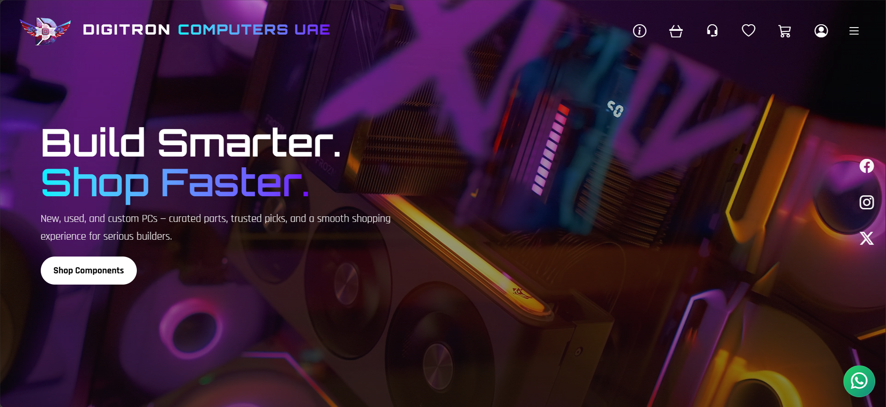
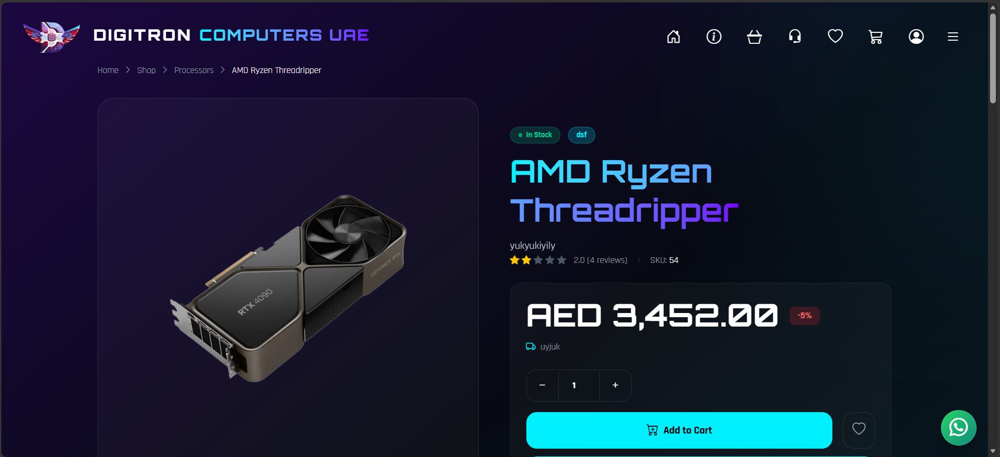
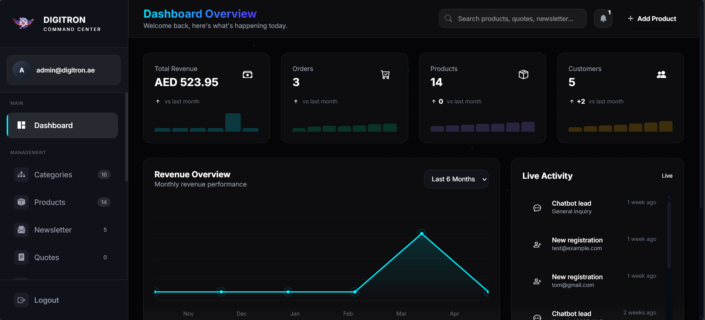

# Digitron Computers

🌐 Live Website: https://digitroncomputers.com

---

## 🚀 Overview

Digitron Computers is a full-scale, dynamic e-commerce platform built with a strong focus on performance, scalability, and real-world business operations.

The system is designed as a **fully admin-controlled platform**, where every section of the website — from products to pricing, content, and configurations — can be managed without modifying code.

It combines a modern frontend experience with a powerful backend system to deliver a seamless shopping and management workflow.

---

## ⚡ Key Features

### 🛍️ E-Commerce System

* Dynamic product & category management
* Shopping cart & checkout system
* Cash on Delivery (COD) support
* Order management system
* Stock management & inventory tracking
* Tax and shipping configuration system
* Online payment integration (Coming Soon)

---

### ⚙️ Advanced Admin Panel

* Full control over **products, categories, and homepage content**
* Manage **newsletter subscriptions**
* Handle **customer quotes and inquiries**
* Admin-controlled homepage showcase sections
* Real-time **order tracking and management**
* Notification system based on user actions

---

### 🤖 Smart WhatsApp Chatbot

* Dynamic WhatsApp chatbot integration
* Auto-replies based on user queries
* Lead generation system via chatbot
* Improves customer engagement and response time

---

### 🌐 Frontend Experience

* Modern UI based on international standards
* Fully responsive and mobile-optimized design
* Smooth user interactions and clean layout
* Fast loading and optimized performance

---

## 🧠 System Capabilities

* Fully dynamic system controlled via admin panel
* No hardcoded content — everything is database-driven
* Scalable architecture for future feature expansion
* Built for real-world business usage

---

## 🛠️ Tech Stack

* **Backend:** Laravel
* **Frontend:** Tailwind CSS, Alpine.js, JavaScript, jQuery
* **Database:** MySQL

---

## 📸 Screenshots

### 🏠 Homepage

### ℹ️ About Page

### 🛒 Shop Page

### 📦 Product Page

### 🧾 Cart Page

### ⚙️ Admin Panel

---

## ⚙️ Installation

1. Clone the repository
2. Run `composer install`
3. Configure `.env` file
4. Run `php artisan migrate`
5. Run `php artisan serve`

---

## 🌐 Live Demo

https://digitroncomputers.com

---

## 👨‍💻 Author

Anas Ahamed
